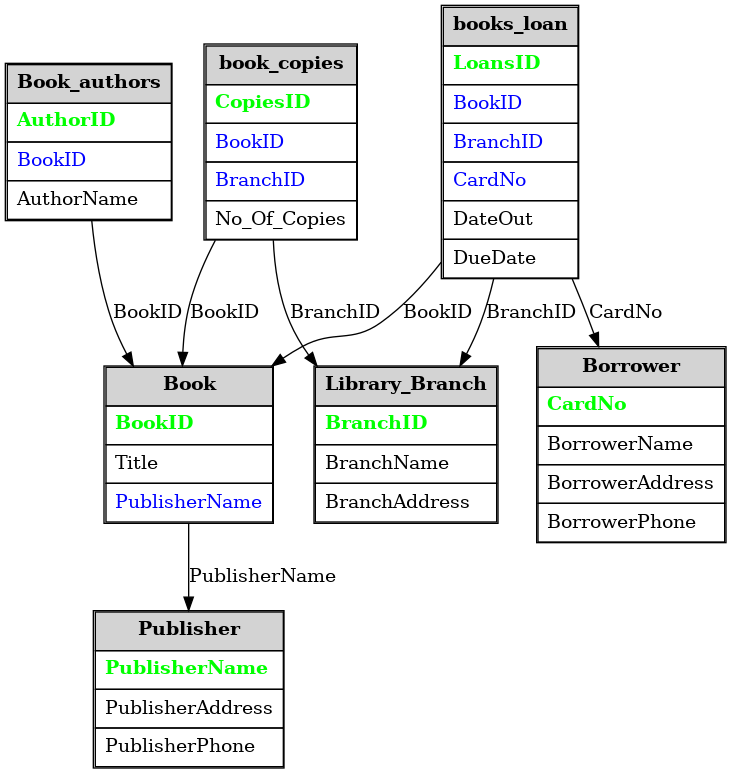

# 📚 Library Management System — SQL Analytics Project

This project implements a relational **Library Management System** using SQL and explores various analytics through structured queries.  
It focuses on understanding database schema design, SQL joins, grouping, ranking, and cumulative analysis — all using MySQL and the Table Data Import Wizard.

---

## 🗂️ Repository Structure

```
.
├── Datasets/
│   ├── authors.csv
│   ├── book_copies.csv
│   ├── book_loans.csv
│   ├── books.csv
│   ├── borrowers.csv
│   ├── library_branch.csv
│   └── publisher.csv
│
├── doc/
│   └── library_er_diagram_git_ready.png   # 📷 ER Diagram
│
├── scripts/
│   ├── 01_init_database.sql
│   ├── 02_database_exploration.sql
│   ├── 03_dimensions_exploration.sql
│   ├── 04_measures_exploration.sql
│   ├── 05_magnitude_analysis.sql
│   ├── 06_ranking_analysis.sql
│   └── 07_cumulative_analysis.sql
│
└── README.md
```

---

## 🛠️ Tech Stack

| Component        | Tool |
|------------------|------|
| **Database**     | MySQL 8.x |
| **Interface**    | MySQL Workbench |
| **Data Import**  | Table Data Import Wizard |
| **Scripting**    | Raw SQL scripts only (no procedures, views, or triggers) |

---

## 🗃️ Tables Overview

| Table            | Description |
|------------------|-------------|
| `authors`        | Author details |
| `publisher`      | Publisher information |
| `books`          | Book metadata (linked to authors & publishers) |
| `library_branch` | Branch locations |
| `book_copies`    | Number of copies per book at each branch |
| `borrowers`      | Library members |
| `book_loans`     | Records of books borrowed and returned |

---

## 📷 Entity Relationship Diagram (ERD)



---

## ⚙️ Setup Instructions

1. **Run SQL Schema**
   - Open MySQL Workbench
   - Run `scripts/01_init_database.sql` to create all tables with primary/foreign keys

2. **Import Data via Wizard**
   - Right-click on each table → **Table Data Import Wizard**
   - Choose the matching CSV file from `Datasets/`
   - Repeat for all tables

3. **Run Analytics Scripts**
   - Open each script in the `scripts/` folder and run them in order
   - Each script contains meaningful queries for exploring the data

---

## 📊 Script Breakdown

| Script                          | What it Does |
|---------------------------------|---------------|
| `01_init_database.sql`         | Creates schema, tables, and relationships |
| `02_database_exploration.sql`  | Checks data sanity, row counts, basic joins |
| `03_dimensions_exploration.sql`| Analyzes categorical dimensions like authors, branches |
| `04_measures_exploration.sql`  | Computes aggregates like total loans, copies |
| `05_magnitude_analysis.sql`    | Finds branches with most/least books or loans |
| `06_ranking_analysis.sql`      | Ranks books, authors, borrowers |
| `07_cumulative_analysis.sql`   | Tracks borrow trends over time |

---

## 🔍 Sample Queries

```sql
-- Top 3 most borrowed books
SELECT b.Title, COUNT(*) AS BorrowCount
FROM books b
JOIN books_loan bl ON b.BookID = bl.BookID
GROUP BY b.Title
ORDER BY BorrowCount DESC
LIMIT 3;

-- Number of books per branch
SELECT lb.BranchName, SUM(bc.No_Of_Copies) AS TotalBooks
FROM book_copies bc
JOIN library_branch lb ON bc.BranchID = lb.BranchID
GROUP BY lb.BranchName;
```

---

## ✅ Highlights

- ✅ 7 SQL scripts for structured data exploration
- ✅ Clean relational schema with 7 well-normalized tables
- ✅ GUI-based data import — no CLI required
- ✅ No advanced features (no triggers, views, or stored procedures) — fully beginner-friendly

---

## 👨‍💻 Author

| | |
|---|---|
| **Name** | _Rohith Maddikunta_ |
| **GitHub** | [@yourhandle](https://github.com/Rohithhh16) |
| **Email** | rohithmaddikunta@gmail.com |

---

## 📄 License

This project is open-source for learning and academic use. Attribution appreciated.
